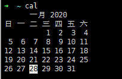
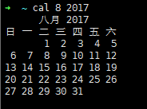
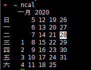
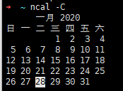
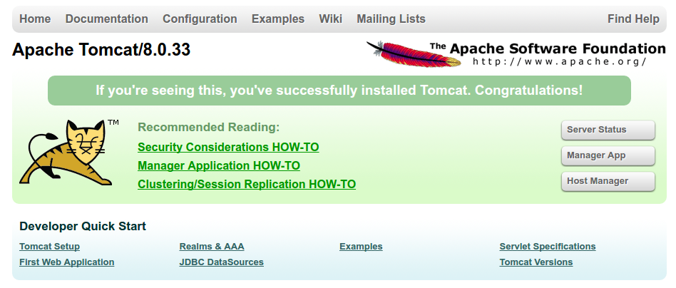
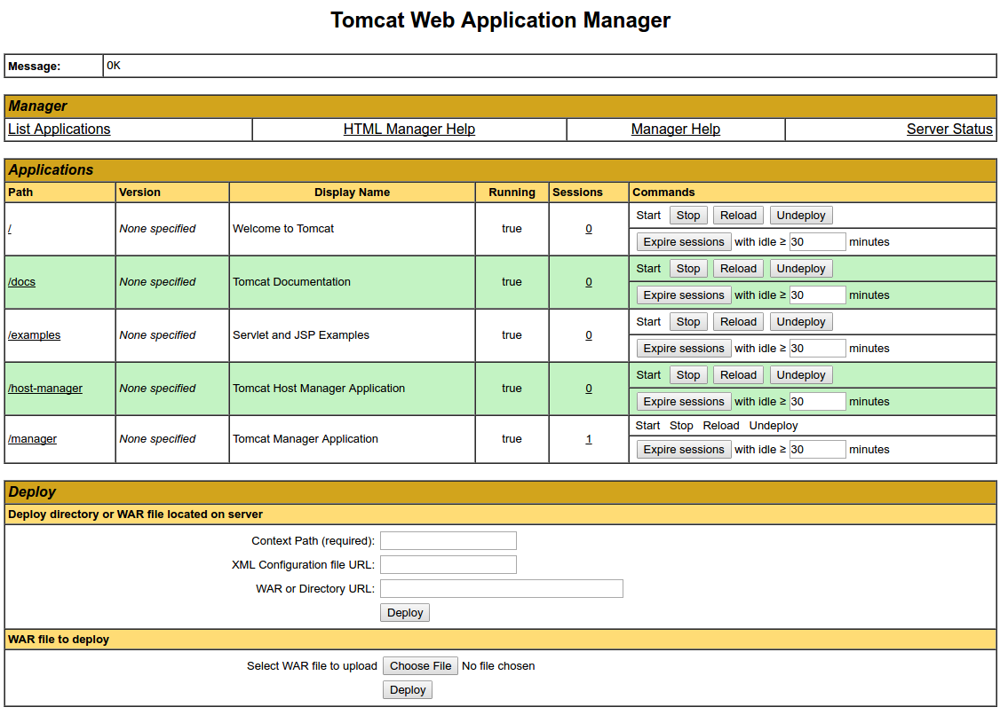
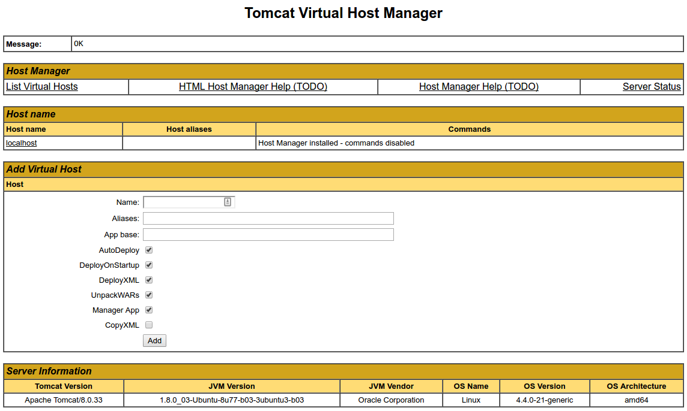

#  Linux


# 常用命令

## 文件/目录

> cd	切换目录
>
> > 语法: 
>
> find		查找文件或目录
>
> > 语法	find   path   -option   [   -print ]   [ -exec   -ok   command ]   {} \
> >
> > 例子
> > find . -name "*.c"

## 网络

更新包信息，确保APT能使用https方式工作，并且CA证书已安装了

```shell
sudo apt-get update # 更新包信息

sudo apt-get install apt-transport-https ca-certificates
```

## 常用命令

笔者常用Linux系统为Ubuntu , 某些命令是其特有的

### 文件/文件夹

#### cd

切换当前工作目录至 dirName(目录参数)。其中 dirName 表示法可为绝对路径或相对路径。若目录名称省略，则变换至使用者的 home 目录 (也就是刚 login 时所在的目录)。另外，"~" 也表示为 home 目录 的意思，"." 则是表示目前所在的目录，".." 则表示目前目录位置的上一层目录。

```shell
示例:
	cd # 相当于 'cd ~' 进入当前用户主目录
	cd /root
	cd ../..
```

#### cat

用于连接文件并打印到标准输出设备上。

```shell
cat [-AbeEnstTuv] [--help] [--version] fileName
	参数说明：
    -n 或 --number：由 1 开始对所有输出的行数编号。
    -b 或 --number-nonblank：和 -n 相似，只不过对于空白行不编号。
    -s 或 --squeeze-blank：当遇到有连续两行以上的空白行，就代换为一行的空白行。
    -v 或 --show-nonprinting：使用 ^ 和 M- 符号，除了 LFD 和 TAB 之外。
    -E 或 --show-ends : 在每行结束处显示 $。
    -T 或 --show-tabs: 将 TAB 字符显示为 ^I。
    -A, --show-all：等价于 -vET。
    -e：等价于"-vE"选项；
    -t：等价于"-vT"选项；
示例:
	# 把 file1 的文档内容加上行号后输入 file2 这个文档里：
	cat -n file1 > textfile2
	# 把'file1'和'file2'的文件内容加上行号(空白行不加)之后附加到'file3'里：
	cat -b file1 textfile2 >> textfile3
	# 清空 /etc/test.txt 文档内容：
	cat /dev/null > /etc/test.txt
	cat 也可以用来制作镜像文件。例如要制作软盘的镜像文件，将软盘放好后输入：
    cat /dev/fd0 > OUTFILE
    相反的，如果想把 image file 写到软盘，输入：
    cat IMG_FILE > /dev/fd0
注：
    1. OUTFILE 指输出的镜像文件名。
    2. IMG_FILE 指镜像文件。
    3. 若从镜像文件写回 device 时，device 容量需与相当。
    4. 通常用制作开机磁片。
```

#### mv

用来为文件或目录改名、或将文件或目录移入其它位置

```shell
mv [options] source dest
mv [options] source... directory

参数说明：
    -i: 若指定目录已有同名文件，则先询问是否覆盖旧文件;
    -f: 在 mv 操作要覆盖某已有的目标文件时不给任何指示;
mv参数设置与运行结果
    mv 文件名 文件名	: 将源文件名改为目标文件名
    mv 文件名 目录名	: 将文件移动到目标目录
    mv 目录名 目录名	: 目标目录已存在，将源目录移动到目标目录；目标目录不存在则改名
    mv 目录名 文件名	: 出错

示例:
    # 将文件 aaa 更名为 bbb
    mv aaa bbb
    # 将info目录放入logs目录中。注意，如果logs目录不存在，则该命令将info改名为logs
    mv info/ logs 
    # 再如将/usr/student下的所有文件和目录移到当前目录下，命令行为
    mv /usr/student/*  
```


#### rm

用于删除一个文件或者目录

```shell
rm [options] name...

参数：
    -i 删除前逐一询问确认。
    -f 即使原档案属性设为唯读，亦直接删除，无需逐一确认。
    -r 将目录及以下之档案亦逐一删除。
示例:
	# 删除文件可以直接使用rm命令，若删除目录则必须配合选项"-r"，例如：
    rm  test.txt 
    	rm：是否删除 一般文件 "test.txt"? y  
    rm  homework  
    	rm: 无法删除目录"homework": 是一个目录  
    rm  -r  homework  
    	rm：是否删除 目录 "homework"? y 
    	
    # 删除当前目录下的所有文件及目录，命令行为：
	rm  -r  *
	
	# 删除当前目录下的所有文件及目录，并且是直接删除，无需逐一确认命令行为：
	rm  -rf  要删除的文件名或目录
        #删除文件名 test.txt:
        rm  -rf   test.txt
        # 删除目录 test，不管该目录下是否有子目录或文件，都直接删除:
        rm  -rf   test/
```

#### pwd

显示当前所在目录

```shell

```

#### mkdir

新建文件夹

```shell
mkdir 
```

#### touch

新建空白文件

```shell
touch  # 新建空白文件
```


#### find

查找文件/文件夹

```shell
find [PATH] [Option] [action]
    -newer file:file为一个存在的文件，列出比file还要新的文件名
    find / -mtime 0———0代表当前的时间，即从现在开始到24小时前，有改动过内容的文件都会被列出来
    find /etc -newer /etc/passwd———寻找/etc下面的文件，如果文件日期比/etc/passwd新就列出
    find / -name file——/代表全文搜索
    find /home -user Anmy——查找/home下属于Anmy的文件
    find / -nouser—— 查找系统中不属于任何人的文件，可以轻易找出那些不太正常的文件
    find / -name passed—— 查找文件名为passed的文件

find其他参数：
    -type TYPE: 查找文件类型为TYPE的，类型主要有：一般正规文件(f)、设备文件(b,c)、目录(d)、连接文件(l)、socket（s）及FIFO(p)等属性
    -perm mode: 查找文件权限刚好等于mode的文件
    -perm +mode:查找文件权限“包含任一mode的权限”的文件。
    -perm -mode:查找文件权限“必须要全部包括mode的权限”的文件。

find后其他可进行的操作：
    -exec command:command为其他命令，-exec后面可再接其他的命令来处理查找到的结果。
    -print:将结果打印到屏幕上，为默认操作。
示例:
	find / -name 'aaa' -type d	# 在'/'目录下查找名字为'aaa'的目录
	find / -name 'server.xml' -print # 查找server.xml文件的位置
```

### 用户/权限

#### su

切换用户,默认为root

```shell
示例:
    su  # 切换为root用户
    su kvm # 切换成用户名为'kvm'的用户
```

#### sudo

以root权限执行

```shell
示例:
	sudo apt update
```

### 时间日期

#### date

显示当前系统时间

```shell
date # 打印结果如下
```


#### cal/ncal

打印日历

```shell
示例:
	cal # 打印当前月日历
	cal 8 2017 # 打印2017年8月的日历
	ncal  # 转置的日历
	ncal -C  # 正过来了(-_-)!!!
```







### 系统

``` shell
uname
	uname -a
	uname -r
```


### 其它

```shell
sl  # 小火车(需要安装)
```


linux

```shell
cat / bat  
ls -a/-Arf
alias   // 别名

apt / snap / yum   // 包管理

find		查找
	/ -name file1	从'/'开始进入根目录文件系统搜索文件和目录
	/ -user user1	搜索属于用户'user1'的文件和目录
	/home -name \*bin	在/home下搜索以bin结尾的文件
	/home -type f -atime +100 搜索在过去100天内未被使用过的文件
mount	/dev/hda2 /mnt/hda2 	挂载一个叫做hda2的盘 /mnt/hda2 已存在
umount 	/dev/hda2 	卸载一个叫做hda2的盘(先从)
	update - 从服务器更新可用的软件包列表。
upgrade - 根据列表，更新已安装的软件包。upgrade 不会删除在列表中已经没有的软件包，也不会安装有依赖需求但尚未安装的软件包。
full-upgrade - 根据列表，更新已安装的软件包。full-upgrade 可能会为了解决软件包冲突而删除一些已安装的软件包。
dist-upgrade - 根据列表，更新已安装的软件包。dist-upgrade 可能会为了解决软件包冲突而删除一些已安装的软件包，也可能会为了解决软件包依赖问题安装新的软件包。	
```

## 远程连接

安装openssh-server, 可在windows下用Xshell等工具连接

lrzsz 用于传输文件


## 一些问题

### xshell 使用 Oh My ZSH home键 end键 小键盘区无效解决办法

[2017-09-10](https://anjia0532.github.io/2017/09/10/zsh-home-end-keypad-not-work/)

zsh是一款超赞的shell工具，但是配置复杂，有个闲着没事的程序员，弄了一个开源项目 [robbyrussell/oh-my-zsh](https://github.com/robbyrussell/oh-my-zsh) 截止目前，58.8k+ star就知道有多火了。比如 Spring boot在github才 15.7K+ spring framework 也16.1k+,最近火到炸天的tensorflow 69.4k

同样很优秀的有 [fisherman/fisherman](https://github.com/fisherman/fisherman)

此文不讲如何安装，如何配置 。有此需求的同学，出门左转，找度娘解决。

此文主要解决，xshell 远程连接时，host将zsh设置成默认shell时，Home,End,小键盘区诸键无效问题

参考连接 [Cannot using home/end key after install oh-my-zsh](https://github.com/robbyrussell/oh-my-zsh/issues/3061#issuecomment-93494905)


第一种方法也是最简单的办法是，修改xshell连接此host的终端类型，改成`linux`


但是注意 [@linlinlinlin ](https://github.com/linlinlinlin)所说，改用`linux`可能会导致shell的颜色比较奇怪。

`linux``xterm`

结合 [@candrew34](https://github.com/candrew34) 和 [@linlinlinlin ](https://github.com/linlinlinlin)的回复，得出第二种方案

第二种方法，稍微复杂点

```shell
cat <<ENDOF >> ~/.zshrc
# Home
bindkey '\e[1~' beginning-of-line
# End
bindkey '\e[4~' end-of-line

# Keypad
# 0 . Enter
bindkey -s "^[Op" "0"
bindkey -s "^[Ol" "."
bindkey -s "^[OM" "^M"
# 1 2 3
bindkey -s "^[Oq" "1"
bindkey -s "^[Or" "2"
bindkey -s "^[Os" "3"
# 4 5 6
bindkey -s "^[Ot" "4"
bindkey -s "^[Ou" "5"
bindkey -s "^[Ov" "6"
# 7 8 9
bindkey -s "^[Ow" "7"
bindkey -s "^[Ox" "8"
bindkey -s "^[Oy" "9"
# + -  * /
bindkey -s "^[Ok" "+"
bindkey -s "^[Om" "-"
bindkey -s "^[Oj" "*"
bindkey -s "^[Oo" "/"
ENDOF

source ~/.zshrc
```

另附 [客户端putty, xshell连接linux中vim的小键盘问题](http://blog.csdn.net/jiedushi/article/details/6266944)


# Ubuntu

## Ubuntu18.04安装MySQL8.0

为什么要做这个呢？因为不知道为什么我Ubuntu18.04 安装MySQL5.7 之后，终端不能输入中文。网上的方法试了个遍。无论是各种改utf8，还是系统字符集更改，还是添加字符集，等等，都不行。无奈，只好卸载5.7，装上最新的MySQL8.0. 装完之后立马就可以输入中文，开心。嘿嘿！  

首先删除mysql:

```shell
sudo apt-get remove mysql-*
```

 然后清理残留的数据

```shell
 dpkg -l |grep ^rc|awk '{print $2}' |sudo xargs dpkg -P
```

它会跳出一个对话框，你选择yes就好了

然后就是安装了，但是呢，**不能用**

```shell
sudo apt-get install mysql-client mysql-server
```

为什么呢？因为这时候安装的还是5.7.阅读了一下MySQL安装指南，发现MySQL5.7版本最高只适配到Ubuntu17.04，而MySQL8.0最高适配到Ubuntu18.04。

那怎么办呢？ 官网去整一个答案回来. 如下：

首先要去[官网]( http://dev.mysql.com/downloads/repo/apt/) 下载一个 mysql-apt-config_0..***_all.deb，

在文件夹中找到下载的具体文件，并执行（下面的 * **是省略的意思，你自己要改）**

```shell
sudo dpkg -i mysql-apt-config_0.*.****_all.deb
```

安装执行, 然后会出现一个紫色框界面.  它有四个选项。选择第一个, enter确定, 然后又会出现一个紫色框界面, 选择8.0那个。enter确定， 会回到第一个紫色框，此时按上下键选择 ok，enter确定。

之后执行

```shell
 sudo apt-get update
 sudo apt-get install mysql-server
```

安装过程中会询问，都选择yes. 安装最后会出现紫色框，让你输入密码，输入完成之后，会再让你输入一遍。确定. 输入完成之后，会出现紫色框问你选择密码的加密方式。因为第一种加密方式Ubuntu不支持，所以我们选择第二个加密方式。enter确定。

此时启动MySQL：

```shell
service mysql start
```

进入MySQL: 

```
mysql -uroot -p
```

输入中文测试，成功！

参考：
	https://www.jianshu.com/p/c76b31df5d09
	https://jingyan.baidu.com/article/fdbd4277bb981ab89e3f4897.html
	https://blog.csdn.net/weixin_37946237/article/details/81634505

### 问题

- 连接MySQL时报错:

    ```shell
    ERROR 2002 (HY000): Can't connect to local MySQL server through socket '/tmp/mysql.sock' (2)
    ```

    **解决办法:**

    我的第一个建议是检查MySQL服务器是否正在运行。第二个建议可能是，MySQL服务器是否在另一个主机上运行？如果是，则添加`-h `标记到终端中的MySQL客户端。

    如果MySQL确实在运行，并且在本地运行，请检查`my.cnf`档案。应该有这样一条线

    ```javascript
    socket = /var/run/mysqld/mysqld.sock
    ```

    看看这是否与您在文章中提到的套接字位置相匹配。

    根据经验，我认为最有可能的情况是MySQL服务器要么根本没有运行，要么没有在与从终端运行MySQL客户端的主机相同的主机上运行。

- 无法远程连接

    从MySQL 8开始，您不再可以（隐式）使用`GRANT`命令创建用户。请改用[CREATE USER](https://dev.mysql.com/doc/refman/8.0/en/create-user.html)，然后使用[GRANT](https://dev.mysql.com/doc/refman/8.0/en/grant.html)语句：

    ```sql
    mysql> CREATE USER 'root'@'%' IDENTIFIED BY 'root';
    mysql> GRANT ALL PRIVILEGES ON *.* TO 'root'@'%' WITH GRANT OPTION;
    ```

## tomcat安装

### 介绍

Apache Tomcat是一个Web服务器和servlet容器，用于为Java应用程序提供服务。 Tomcat是Apache Software Foundation发布的Java Servlet和JavaServer Pages技术的开源实现。 本教程介绍了Ubuntu 18.04服务器上最新版Tomcat 9的基本安装和一些配置。

### 先决条件

在开始本指南之前，您应该拥有一个在您的服务器上设置了`sudo`权限的非root用户。 您可以通过完成我们的[Ubuntu 16.04初始服务器设置指南](https://www.howtoing.com/initial-server-setup-with-ubuntu-16-04/)来了解如何执行此操作。

### 第1步-安装Java

Tomcat要求在服务器上安装Java，以便可以执行任何Java Web应用程序代码。 我们可以通过apt安装OpenJDK来满足这个要求。

首先，更新你的apt包索引：

```shell
sudo apt update
```

然后使用apt安装Java Development Kit软件包：

```shell
sudo apt install default-jdk
```

现在已经安装了Java，我们可以创建一个`tomcat`用户，该用户将用于运行Tomcat服务。

### 第2步-创建Tomcat用户

出于安全考虑，Tomcat应该作为非特权用户运行（即不是root用户）。 我们将创建一个将运行Tomcat服务的新用户和组。

首先，创建一个新的`tomcat`组：

```shell
sudo groupadd tomcat
```

接下来，创建一个新的`tomcat`用户。 我们将使这个用户成为`tomcat`组的成员，主目录为`/opt/tomcat` （我们将安装Tomcat），shell为`/bin/false` （因此没有人可以登录该帐户）：

```shell
sudo useradd -s /bin/false -g tomcat -d /opt/tomcat tomcat
```

现在我们已经设置了`tomcat`用户，让我们下载并安装Tomcat。

### 第3步-安装Tomcat

安装Tomcat 9的最佳方法是下载最新的二进制版本，然后手动配置它。

在[Tomcat 9下载页面上](https://tomcat.apache.org/download-90.cgi)找到最新版本的Tomcat 9。 在撰写本文时，最新版本为**9.0.10** ，但如果可用，则应使用更高版本的稳定版本。 在**Binary Distributions**部分下，然后在**Core**列表下，将链接复制到“tar.gz”。

接下来，切换到服务器上的`/tmp`目录。 这是一个很好的下载短暂项目的目录，比如Tomcat tarball，在提取Tomcat内容后我们不需要这样：

```shell
cd /tmp
```

使用`curl`下载从Tomcat网站复制的链接：

```shell
curl -O http://mirror.cc.columbia.edu/pub/software/apache/tomcat/tomcat-9/v9.0.10/bin/apache-tomcat-9.0.10.tar.gz
```

我们将Tomcat安装到`/opt/tomcat`目录。 创建目录，然后使用以下命令将存档解压缩到它：

```shell
sudo mkdir /opt/tomcat
sudo tar xzvf apache-tomcat-9*tar.gz -C /opt/tomcat --strip-components=1
```

接下来，我们可以为我们的安装设置适当的用户权限。

### 第4步 - 更新权限

我们设置的`tomcat`用户需要能够访问Tomcat安装。 我们现在就把它搞定。

切换到我们解压缩Tomcat安装的目录：

```shell
cd /opt/tomcat
```

授予`tomcat`组对整个安装目录的所有权：

```shell
sudo chgrp -R tomcat /opt/tomcat

```

接下来，让`tomcat`组对`conf`目录及其所有内容进行读访问，并**执行**对目录本身的访问：

```shell
sudo chmod -R g+r conf
sudo chmod g+x conf

```

使`tomcat`用户成为`webapps` ， `work` ， `temp`和`logs`目录的所有者：

```shell
sudo chown -R tomcat webapps/ work/ temp/ logs/

```

现在已经设置了适当的权限，我们可以创建一个systemd服务文件来管理Tomcat进程。

### 第5步 - 创建systemd服务文件

我们希望能够将Tomcat作为服务运行，因此我们将设置systemd服务文件。

Tomcat需要知道Java的安装位置。 此路径通常称为“JAVA_HOME”。 查找该位置的最简单方法是运行此命令：

```shell
sudo update-java-alternatives -l
Outputjava-1.11.0-openjdk-amd64       1081       /usr/lib/jvm/java-1.11.0-openjdk-amd64

```

您的`JAVA_HOME`是最后一列的输出（以红色突出显示）。 鉴于上面的示例，此服务器的正确`JAVA_HOME`将是：

```shell
JAVA_HOME/usr/lib/jvm/java-1.11.0-openjdk-amd64

```

你的`JAVA_HOME`可能会有所不同。

有了这条信息，我们就可以创建systemd服务文件了。 键入以下命令，在`/etc/systemd/system`目录中打开名为`tomcat.service`的文件：

```shell
sudo nano /etc/systemd/system/tomcat.service

```

将以下内容粘贴到您的服务文件中。 如有必要，修改`JAVA_HOME`的值以匹配您在系统上找到的值。 您可能还想修改`CATALINA_OPTS`中指定的内存分配设置：

/etc/systemd/system/tomcat.service

```shell
[Unit]
Description=Apache Tomcat Web Application Container
After=network.target

[Service]
Type=forking

Environment=JAVA_HOME=/usr/lib/jvm/java-1.11.0-openjdk-amd64
Environment=CATALINA_PID=/opt/tomcat/temp/tomcat.pid
Environment=CATALINA_HOME=/opt/tomcat
Environment=CATALINA_BASE=/opt/tomcat
Environment='CATALINA_OPTS=-Xms512M -Xmx1024M -server -XX:+UseParallelGC'
Environment='JAVA_OPTS=-Djava.awt.headless=true -Djava.security.egd=file:/dev/./urandom'

ExecStart=/opt/tomcat/bin/startup.sh
ExecStop=/opt/tomcat/bin/shutdown.sh

User=tomcat
Group=tomcat
UMask=0007
RestartSec=10
Restart=always

[Install]
WantedBy=multi-user.target

```

完成后，保存并关闭文件。

接下来，重新加载systemd守护程序，以便它知道我们的服务文件：

```shell
sudo systemctl daemon-reload

```

键入以下命令启动Tomcat服务：

```shell
sudo systemctl start tomcat

```

键入以下内容，仔细检查它是否正常启动：

```shell
sudo systemctl status tomcat

```

### 第6步 - 调整防火墙并测试Tomcat服务器

现在Tomcat服务已启动，我们可以测试以确保默认页面可用。

在我们这样做之前，我们需要调整防火墙以允许我们的请求到达服务。 如果您遵循先决条件，则当前将启用`ufw`防火墙。

Tomcat使用端口`8080`接受传统请求。 输入以下内容允许到该端口的流量：

```shell
sudo ufw allow 8080

```

修改防火墙后，您可以通过在Web浏览器中访问您的域或IP地址，然后访问`:8080`来访问默认启动页面：

```shell
Open in web browserhttp://server_domain_or_IP:8080

```

除了其他信息之外，您还将看到默认的Tomcat启动页面。 但是，例如，如果单击Manager App的链接，则将拒绝您访问。 我们接下来可以配置该访问。

如果您能够成功访问Tomcat，现在是启用服务文件的好时机，以便Tomcat在启动时自动启动：

```shell
sudo systemctl enable tomcat

```

### 第7步-配置Tomcat Web管理界面

为了使用Tomcat附带的管理器Web应用程序，我们必须向Tomcat服务器添加登录。 我们将通过编辑`tomcat-users.xml`文件来完成此操作：

```shell
sudo nano /opt/tomcat/conf/tomcat-users.xml

```

您将需要添加可以访问`manager-gui`和`admin-gui` （Tomcat附带的Web应用程序）的用户。 您可以通过在`tomcat-users`标记之间定义类似于下面示例`tomcat-users`目的。 请务必将用户名和密码更改为安全的内容：

tomcat-users.xml - 管理员用户

```shell
<tomcat-users . . .>
    <user username="admin" password="password" roles="manager-gui,admin-gui"/>
</tomcat-users>

```

完成后保存并关闭文件。

默认情况下，较新版本的Tomcat将对Manager和Host Manager应用程序的访问限制为来自服务器本身的连接。 由于我们在远程计算机上安装，您可能希望删除或更改此限制。 要更改对这些的IP地址限制，请打开相应的`context.xml`文件。

对于Manager应用，请键入：

```shell
sudo nano /opt/tomcat/webapps/manager/META-INF/context.xml

```

对于Host Manager应用程序，请键入：

```shell
sudo nano /opt/tomcat/webapps/host-manager/META-INF/context.xml

```

在内部，注释掉IP地址限制以允许来自任何地方的连接。 或者，如果您只允许访问来自您自己的IP地址的连接，您可以将您的公共IP地址添加到列表中：

Tomcat webapps的context.xml文件

```shell
<Context antiResourceLocking="false" privileged="true" >
  <!--<Valve className="org.apache.catalina.valves.RemoteAddrValve"
         allow="127\.\d+\.\d+\.\d+|::1|0:0:0:0:0:0:0:1" />-->
</Context>

```

完成后保存并关闭文件。

要使我们的更改生效，请重新启动Tomcat服务：

```
sudo systemctl restart tomcat

```

### 第8步-访问Web界面

现在我们已经创建了一个用户，我们可以在Web浏览器中再次访问Web管理界面。 再一次，您可以通过在浏览器中输入端口8080后面的服务器域名或IP地址来访问正确的界面：

```
Open in web browserhttp://server_domain_or_IP:8080

```

您看到的页面应该与您之前测试时给出的页面相同：



我们来看看Manager App，可以通过链接或`http:// server_domain_or_IP :8080/manager/html` 。 您需要输入添加到`tomcat-users.xml`文件的帐户凭据。 之后，您应该看到如下所示的页面：



Web应用程序管理器用于管理Java应用程序。 您可以在此处启动，停止，重新加载，部署和取消部署。 您还可以在应用程序上运行一些诊断程序（即查找内存泄漏）。 最后，本页最下方提供了有关您的服务器的信息。

现在让我们看看主机管理器，可以通过链接或`http:// server_domain_or_IP :8080/host-manager/html/` ：



在Virtual Host Manager页面中，您可以添加虚拟主机以便为您的应用程序提供服务。

### 结论

你的Tomcat安装完成了！ 您现在可以自由部署自己的Java Web应用程序了！

目前，您的Tomcat安装功能正常，但完全未加密。 这意味着所有数据（包括密码等敏感项目）都以纯文本形式发送，可以被互联网上的其他方拦截和阅读。 为了防止这种情况发生，强烈建议您使用SSL加密连接。 您可以按照[本指南](https://www.howtoing.com/how-to-encrypt-tomcat-8-connections-with-apache-or-nginx-on-ubuntu-16-04/)了解如何加密与Tomcat的连接（ *注意：本指南介绍了Ubuntu 16.04上的Tomcat 8加密* ）。


# Manjaro

## **Linux系统Manjaro分辨率调整恢复**

### 意外情况

近期将一台六年前的老笔记本换成了Manjaro系统，今晚外接显示器时突然原笔记本电脑屏幕的分辨率降低，并且在系统设置页面中丢失了原有的1380×760分辨率，最大只有960×540的分辨率。

### 问题解决-通过命令行添加自定义分辨率

既然是linux系统，设置有关的内容一定可以用命令行解决。系统设置丢失了分辨率模式，自己手动加上去就行了。

首先用管理员权限，查看当前显示器的分辨模式

```
sudo xrandr -q
[parrysms@parrysms-pc ~]$ sudo xrandr -q
Screen 0: minimum 8 x 8, current  960x540, maximum 32767 x 32767
LVDS1 connected primary  960x540+0+0 (normal left inverted right x axis y axis) 310mm x 170mm
   960x540       59.82  
   864x486       60.00    59.92    59.57  
   640x480       59.94  
DP1 disconnected (normal left inverted right x axis y axis)
HDMI1 disconnected (normal left inverted right x axis y axis)
VGA1 disconnected (normal left inverted right x axis y axis)
```

命令行会显示系统里有的分辨率。如果没有你显示器对应的分辨率，那么就需要自行添加，添加的第一步是使用`cvt`设置自定义分辨率。注意这里`cvt`命令后面两个的分辨率参数一定得是小于等于显示器最大支持的分辨率。

```
sudo cvt 1360 768
[parrysms@parrysms-pc ~]$ cvt 1360 768
# 1360x768 59.80 Hz (CVT) hsync: 47.72 kHz; pclk: 84.75 MHz
Modeline "1360x768_60.00"   84.75  1360 1432 1568 1776  768 771 781 798 -hsync +vsync
```

此时将会显示两行信息，找到 `Modeline "1360x768_60.00"` 的这个部分。Modeline 后面的 “1380x760_60.00” 部分是这个分辨率的模式及的名字，从引号开始到最后全部选中复制下来。（命令行里鼠标右键有复制选项）

使用参数新增分辨率模式，指令如下：
`xrandr --newmode 加上Modeline 后面的分辨率模式名以及一连串数字`

举例而言，我的指令是
`sudo xrandr --newmode "1360x768_60.00" 84.75 1360 1432 1568 1776 768 771 781 798 -hsync +vsync`

最后，需要将新的自定义分辨率模式，添加到指定的显示器配置中，显示器名字就是最开始`sudo xrandr -q` 命令中看到有分辨率模式的那个显示器。如果不想往上翻可以重新敲命令查一次。

```
[parrysms@parrysms-pc ~]$ sudo xrandr -q
Screen 0: minimum 8 x 8, current  960x540 maximum 32767 x 32767
LVDS1 connected primary  960x540+0+0 (normal left inverted right x axis y axis) 310mm x 170mm
   960x540       59.82  
   864x486       60.00    59.92    59.57  
   640x480       59.94  
DP1 disconnected (normal left inverted right x axis y axis)
HDMI1 disconnected (normal left inverted right x axis y axis)
VGA1 disconnected (normal left inverted right x axis y axis)
```

这里可以看到笔记本自带的显示器名字是 `LVDS1`，所以使用`addmode`指令来添加。指令如下：

```
sudo xrandr --addmode 显示器名 分辨率模式名
```

因此我的指令是 （注意引号）：
`sudo xrandr --addmode LVDS1 "1360x768_60.00"`

最后一步，output 输出使其配置生效即可。指令如下：

```
sudo xrandr --output 显示器名 --mode 分辨率模式名
```

因此我的指令是 （注意引号）：
`sudo xrandr --output LVDS1 --mode "1360x768_60.00"`

最后敲下回车，随着屏幕一闪，自定义分辨率就生效了。


# zsh

## shell (计算机壳层)

在计算机科学中，Shell俗称壳（用来区别于核），是指“为使用者提供操作界面”的软件（命令解析器）。它类似于[DOS](https://baike.baidu.com/item/DOS)下的command.com和后来的cmd.exe。它接收用户命令，然后调用相应的应用程序。

**基本上shell分两大类：**

**一：图形界面shell（Graphical User Interface shell 即 GUI shell）**

例如：应用最为广泛的 Windows Explorer （微软的windows系列操作系统），还有也包括广为人知的 Linux shell，其中[linux](https://baike.baidu.com/item/linux) shell 包括 X window manager (BlackBox和FluxBox），以及功能更强大的CDE、GNOME、KDE、 XFCE。

**二：命令行式shell（Command Line Interface shell ，即CLI shell）**

例如：

bash / sh / ksh / csh / zsh（Unix/linux 系统）

（[MS-DOS](https://baike.baidu.com/item/MS-DOS)系统）

[cmd.exe](https://baike.baidu.com/item/cmd.exe)/ 命令提示字符（[Windows NT](https://baike.baidu.com/item/Windows NT) 系统）

Windows PowerShell（支持 .NET Framework 技术的 Windows NT 系统）

传统意义上的shell指的是命令行式的shell，以后如果不特别注明，shell是指命令行式的shell。

文字操作系统与外部最主要的接口就叫做shell。shell是操作系统最外面的一层。shell管理你与操作系统之间的交互：等待你输入，向操作系统解释你的输入，并且处理各种各样的操作系统的输出结果。

shell提供了你与操作系统之间通讯的方式。这种通讯可以以交互方式（从键盘输入，并且可以立即得到响应），或者以shell script(非交互）方式执行。shell script是放在文件中的一串shell和操作系统命令，它们可以被重复使用。本质上，shell script是命令行命令简单的组合到一个文件里面。

Shell基本上是一个命令[解释器](https://baike.baidu.com/item/解释器)，类似于[DOS](https://baike.baidu.com/item/DOS)下的command。它接收用户命令（如ls等），然后调用相应的应用程序。较为通用的shell有标准的Bourne shell (sh）和C shell (csh）。

交互式shell和非交互式shell

交互式模式就是shell等待你的输入，并且执行你提交的命令。这种模式被称作交互式是因为shell与用户进行交互。这种模式也是大多数用户非常熟悉的：登录、执行一些命令、签退。当你签退后，shell也终止了。

shell也可以运行在另外一种模式：非交互式模式。在这种模式下，shell不与你进行交互，而是读取存放在文件中的命令，并且执行它们。当它读到文件的结尾，shell也就终止了。

shell的类型

在[UNIX](https://baike.baidu.com/item/UNIX)中主要有：

Bourne shell （包括 sh,ksh,and bash)

Bourne shell ( sh)

Korn shell ( ksh)

Bourne Again shell ( bash)

POSIX shell ( sh)

C shell （包括 csh and tcsh)

C shell ( csh)

TENEX/TOPS C shell ( tcsh)

**Bourne Shell**

**
**　　

首个重要的标准Unix Shell是1979年底在V7 Unix(AT&T第7版）中引入的，并且以它的创始科技部基础条件平台“国家气象网络计算应用节点建设”（2004DKA50730）资助者Stephen Bourne的名字命名。Bourne shell 是一个交换式的命令[解释器](https://baike.baidu.com/item/解释器)和命令编程语言。Bourne shell 可以运行为login shell或者login shell的子shell(subshell）。只有login命令可以调用Bourne shell作为一个login shell。此时，shell先读取/etc/profile文件和$HOME/.profile文件。/etc/profile文件为所有的用户定制环境，$HOME/.profile文件为本用户定制环境。最后，shell会等待读取你的输入。

**C Shell**

Bill Joy于20世纪80年代早期，在伯克利的[加利福尼亚大学](https://baike.baidu.com/item/加利福尼亚大学)开发了C shell。它主要是为了让用户更容易的使用交互式功能，并把ALGOL风格的语法结构变成了C语言风格。它新增了命令历史、别名、文件名替换、[作业控制](https://baike.baidu.com/item/作业控制)等功能。

**Korn Shell**

有很长一段时间，只有两类shell供人们选择，Bourne shell用来编程，C shell用来交互。为了改变这种状况，AT&T的bell实验室David Korn开发了Korn shell。ksh结合了所有的C shell的交互式特性，并融入了Bourne shell的语法。因此，Korn shell广受用户的欢迎。它还新增了数学计算，进程协作（coprocess）、行内编辑（inline editing）等功能。Korn Shell 是一个交互式的命令解释器和命令编程语言.它符合POSIX——一个操作系统的国际标准.POSIX不是一个操作系统，而是一个目标在于应用程序的移植性的标准——在[源程序](https://baike.baidu.com/item/源程序)一级跨越多种平台。

**Bourne Again Shell (bash)**

bash是[GNU](https://baike.baidu.com/item/GNU)计划的一部分，用来替代Bourne shell。它用于基于GNU的系统如Linux.大多数的Linux(Red Hat,Slackware,Caldera）都以bash作为缺省的shell，并且运行sh时，其实调用的是bash。

**POSIX Shell**

POSIX shell 是Korn shell的一个变种. 当前提供POSIX shell的最大卖主是[Hewlett-Packard](https://baike.baidu.com/item/Hewlett-Packard)。在HP-UX 11.0,POSIX shell 就是/bin/sh，而[bsh](https://baike.baidu.com/item/bsh)是/usr/old/bin/sh.

各主要操作系统下缺省的shell:

[AIX](https://baike.baidu.com/item/AIX)下是Korn Shell.

[Solaris](https://baike.baidu.com/item/Solaris)缺省的是Bourne shell.

[FreeBSD](https://baike.baidu.com/item/FreeBSD)缺省的是C shell

[HP-UX](https://baike.baidu.com/item/HP-UX)缺省的是POSIX shell.

[Linux](https://baike.baidu.com/item/Linux)是Bourne Again shell.

[Windows PowerShell](https://baike.baidu.com/item/Windows PowerShell)是一种新的交互式的命令行和基于任务脚本编写技术，它使信息技术(IT) 管理员能够全面地自动操作和控制系统管理任务，从而提高了管理员的生产力。Windows PowerShell 包括多个系统管理实用工具、一致的语法和命名惯例、及对普通管理数据更好地导航，如登记、证书存储 或 Windows Management Instrumentation (WMI）。Windows PowerShell 还专门针对 IT 管理，提供直观的[脚本编写](https://baike.baidu.com/item/脚本编写)语言。

Shell也是一个VB函数，它的作用是运行程序，语法是Shell（命令字符串[，窗口类型])


## 用途

使用用户的缺省凭证和环境执行 shell。

在UEFI环境下，EFI的Shell环境提供了一组丰富的扩展和增强的命令，在以后的计算机中，传统的DOS界面将会被SHELL环境所取代，所有的.exe文件将不会在以后支持SHELL的环境中出现，取而代之的文件后缀是.efi。在SHELL环境下，分为IA32和X64，32位的*.efi文件不能在X64的计算机中运行。


1. 相对于其他系统，Mac 的主要优势是什么？
2. 你们平时用哪种 Shell？
    ……

第一个童靴可以坐下了，Mac 的最大优势是 GUI 和命令行的完美结合，不要把所有注意力放在 Mac 性感的腰身和明媚的显示屏上好吧，这不是妹纸！第二个童靴你可以出去面壁了，讲了这么多期 MacTalk 你告诉我还在用 Windows 的 cmd， 你让 Mac 君情何以堪？哪怕你就说在用 Linux 的 Bash 我也就原谅你了，踢飞！

上次在「如何学习一门编程语言」里提到了 Shell，也有读者问到 Shell 的问题，所以这次给大家说说 Shell 的事。

我在「趣谈个人建站」里介绍过一点 Shell，自己的东西借用下不丢人，把扯淡的拿掉，干货留下，就是如下内容：

Shell是Linux/Unix的一个外壳，你理解成衣服也行。它负责外界与Linux内核的交互，接收用户或其他应用程序的命令，然后把这些命令转化成内核能理解的语言，传给内核，内核是真正干活的，干完之后再把结果返回用户或应用程序。

Linux/Unix提供了很多种Shell，为毛要这么多Shell？难道用来炒着吃么？那我问你，你同类型的衣服怎么有那么多件？花色，质地还不一样。写程序比买衣服复杂多了，而且程序员往往负责把复杂的事情搞简单，简单的事情搞复杂。牛程序员看到不爽的Shell，就会自己重新写一套，慢慢形成了一些标准，常用的Shell有这么几种，sh、bash、csh等，想知道你的系统有几种shell，可以通过以下命令查看：

```shell
cat /etc/shells
```

显示如下：

```text
/bin/bash
/bin/csh
/bin/ksh
/bin/sh
/bin/tcsh
/bin/zsh
```

在 Linux 里执行这个命令和 Mac 略有不同，你会发现 Mac 多了一个 zsh，也就是说 OS X 系统预装了个 zsh，这是个神马 Shell 呢？

目前常用的 Linux 系统和 OS X 系统的默认 Shell 都是 bash，但是真正强大的 Shell 是深藏不露的 zsh， 这货绝对是马车中的跑车，跑车中的飞行车，史称『终极 Shell』，但是由于配置过于复杂，所以初期无人问津，很多人跑过来看看 zsh 的配置指南，什么都不说转身就走了。直到有一天，国外有个穷极无聊的程序员开发出了一个能够让你快速上手的zsh项目，叫做「oh my zsh」，Github 网址是：[https://github.com/robbyrussell/oh-my-zsh](https://link.zhihu.com/?target=https%3A//github.com/robbyrussell/oh-my-zsh)。这玩意就像「X天叫你学会 C++」系列，可以让你神功速成，而且是真的。

好，下面我们看看如何安装、配置和使用 zsh。

**安装zsh**

如果你用 Mac，就可以直接看下一节
如果你用 Redhat Linux，执行：sudo yum install zsh
如果你用 Ubuntu Linux，执行：sudo apt-get install zsh
如果你用 Windows……去洗洗睡吧。

安装完成后设置当前用户使用 zsh：chsh -s /bin/zsh，根据提示输入当前用户的密码就可以了。

安装oh my zsh

首先安装 git，安装方式同上，把 zsh 换成 git 即可。

安装「oh my zsh」可以自动安装也可以手动安装。

自动安装：

```text
wget https://github.com/robbyrussell/oh-my-zsh/raw/master/tools/install.sh -O - | sh
```

手动安装：

```text
git clone git://github.com/robbyrussell/oh-my-zsh.git ~/.oh-my-zsh
cp ~/.oh-my-zsh/templates/zshrc.zsh-template ~/.zshrc
```

都不复杂，安装完成之后退出当前会话重新打开一个终端窗口，你就可以见到这个彩色的提示了：


**配置**

zsh 的配置主要集中在用户当前目录的.zshrc里，用 vim 或你喜欢的其他编辑器打开.zshrc，在最下面会发现这么一行字：

\# Customize to your needs…

可以在此处定义自己的环境变量和别名，当然，oh my zsh 在安装时已经自动读取当前的环境变量并进行了设置，你可以继续追加其他环境变量。

接下来进行别名的设置，我自己的部分配置如下：

```text
alias cls='clear'
alias ll='ls -l'
alias la='ls -a'
alias vi='vim'
alias javac="javac -J-Dfile.encoding=utf8"
alias grep="grep --color=auto"
alias -s html=mate   # 在命令行直接输入后缀为 html 的文件名，会在 TextMate 中打开
alias -s rb=mate     # 在命令行直接输入 ruby 文件，会在 TextMate 中打开
alias -s py=vi       # 在命令行直接输入 python 文件，会用 vim 中打开，以下类似
alias -s js=vi
alias -s c=vi
alias -s java=vi
alias -s txt=vi
alias -s gz='tar -xzvf'
alias -s tgz='tar -xzvf'
alias -s zip='unzip'
alias -s bz2='tar -xjvf'
```

zsh 的牛粪之处在于不仅可以设置通用别名，还能针对文件类型设置对应的打开程序，比如：

alias -s html=mate，意思就是你在命令行输入 hello.html，zsh会为你自动打开 TextMat 并读取 hello.html； alias -s gz='tar -xzvf'，表示自动解压后缀为 gz 的压缩包。

总之，只有想不到，木有做不到。

设置完环境变量和别名之后，基本上就可以用了，如果你是个主题控，还可以玩玩 zsh 的主题。在 .zshrc 里找到ZSH_THEME，就可以设置主题了，默认主题是：

ZSH_THEME=”robbyrussell”

oh my zsh 提供了数十种主题，相关文件在~/.oh-my-zsh/themes目录下，你可以随意选择，也可以编辑主题满足自己的变态需求，我采用了默认主题robbyrussell，不过做了一点小小的改动：

```text
PROMPT='%{$fg_bold[red]%}➜ %{$fg_bold[green]%}%p%{$fg[cyan]%}%d %{$fg_bold[blue]%}$(git_prompt_info)%{$fg_bold[blue]%}% %{$reset_color%}>'
#PROMPT='%{$fg_bold[red]%}➜ %{$fg_bold[green]%}%p %{$fg[cyan]%}%c %{$fg_bold[blue]%}$(git_prompt_info)%{$fg_bold[blue]%} % %{$reset_color%}'
```

对照原来的版本，我把 c 改为 d，c 表示当前目录，d 表示绝对路径，另外在末尾增加了一个「 > 」，改完之后的效果是这样的：

大家可以尝试进行改造，也算个趣事。

最后我们来说说插件。

**插件**

oh my zsh 项目提供了完善的插件体系，相关的文件在~/.oh-my-zsh/plugins目录下，默认提供了100多种，大家可以根据自己的实际学习和工作环境采用，想了解每个插件的功能，只要打开相关目录下的 zsh 文件看一下就知道了。插件也是在.zshrc里配置，找到plugins关键字，你就可以加载自己的插件了，系统默认加载 git ，你可以在后面追加内容，如下：

```text
plugins=(git textmate ruby autojump osx mvn gradle)
```

下面简单介绍几个：

1、git：当你处于一个 git 受控的目录下时，Shell 会明确显示 「git」和 branch，如上图所示，另外对 git 很多命令进行了简化，例如 gco=’git checkout’、gd=’git diff’、gst=’git status’、g=’git’等等，熟练使用可以大大减少 git 的命令长度，命令内容可以参考~/.oh-my-zsh/plugins/git/git.plugin.zsh

2、textmate：mr可以创建 ruby 的框架项目，tm finename 可以用 textmate 打开指定文件。

3、osx：tab 增强，quick-look filename 可以直接预览文件，man-preview grep 可以生成 grep手册 的pdf 版本等。

4、autojump：zsh 和 autojump 的组合形成了 zsh 下最强悍的插件，今天我们主要说说这货。

首先安装autojump，如果你用 Mac，可以使用 brew 安装：

```text
brew install autojump
```

如果是 Linux，去下载 autojump 的最新版本，比如：

```text
wget https://github.com/downloads/joelthelion/autojump/autojump_v21.1.2.tar.gz
```

解压缩后进入目录，执行

```text
./install.sh
```

最后把以下代码加入.zshrc：

```text
[[ -s ~/.autojump/etc/profile.d/autojump.sh ]] && . ~/.autojump/etc/profile.d/autojump.sh
```

至此，安装、配置、插件三位一体，终极 Shell 全面登场。退出终端会话重新登录，开始感受 zsh 的训疾如风！

**使用 zsh**

1、兼容 bash，原来使用 bash 的兄弟切换过来毫无压力，该咋用咋用。

2、强大的历史纪录功能，输入 grep 然后用上下箭头可以翻阅你执行的所有 grep 命令。

3、智能拼写纠正，输入gtep mactalk * -R，系统会提示：zsh: correct ‘gtep’ to ‘grep’ [nyae]? 比妹纸贴心吧，她们向来都是让你猜的……

4、各种补全：路径补全、命令补全，命令参数补全，插件内容补全等等。触发补全只需要按一下或两下 tab 键，补全项可以使用 ctrl+n/p/f/b上下左右切换。比如你想杀掉 java 的进程，只需要输入 kill java + tab键，如果只有一个 java 进程，zsh 会自动替换为进程的 pid，如果有多个则会出现选择项供你选择。ssh + 空格 + 两个tab键，zsh会列出所有访问过的主机和用户名进行补全

5、智能跳转，安装了autojump之后，zsh 会自动记录你访问过的目录，通过 j + 目录名 可以直接进行目录跳转，而且目录名支持模糊匹配和自动补全，例如你访问过hadoop-1.0.0目录，输入j hado 即可正确跳转。j –stat 可以看你的历史路径库。

6、目录浏览和跳转：输入 d，即可列出你在这个会话里访问的目录列表，输入列表前的序号，即可直接跳转。

7、在当前目录下输入 .. 或 … ，或直接输入当前目录名都可以跳转，你甚至不再需要输入 cd 命令了。

8、通配符搜索：ls -l **/*.sh，可以递归显示当前目录下的 shell 文件，文件少时可以代替 find，文件太多就歇菜了。

9、更强的别名：请参考配置一节。

10、插件支持：请参考插件一节。

……

看完这篇文章，你就知道，zsh一出，无人再与争锋！终极二字不是盖的。

如果你是个正在使用 shell程序员，如果你依然准备使用 bash，那就去面壁和忏悔吧，别说你订阅过 MacTalk！

感谢那位开发了 oh my zsh 的无聊程序员，他可能没有因此收获物质上的利益，但是他的代码提升了无数程序员的效率，节省了大量的时间，我们说，程序员改变世界！

MacTalk 写的多了，朋友和家人都不太理解，这玩意赚不了钱争不了名，写来何用？我想，能够学习、编码、写作，并做出一点帮助别人的东西，总好过炒股炒房的价值吧……

# 结束

